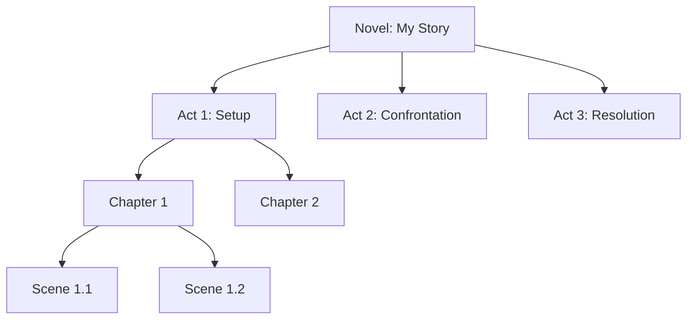

# 🎯 Story Outline Tool Integration Plan

**Datum:** 2025-12-09  
**Source:** `docs_v2/story-outline-tool/` (Konzept-Dokument)  
**Goal:** Integriere beste Ideen in BF Agent Interactive Story Editor

---

## 📋 WAS WIR AUS DEM KONZEPT ÜBERNEHMEN

### **1. HIERARCHISCHE STRUKTUR** ✅ HIGH PRIORITY

#### **Aktuell (zu einfach):**
```python
StoryOutline
├── framework: str
└── beats: List[Beat]
```

#### **Neu (aus Konzept):**
```python
StoryOutline
├── metadata (title, author, genre, logline, synopsis)
├── Acts[]
│   ├── act_number: int
│   ├── name: str (Setup, Confrontation, Resolution)
│   ├── Chapters[]
│   │   ├── chapter_number: int
│   │   ├── title: str
│   │   ├── Scenes[]
│   │   │   ├── pov_character: str
│   │   │   ├── characters: List[str]
│   │   │   ├── location: str
│   │   │   ├── story_datetime: datetime
│   │   │   ├── emotional_arc: Dict[str, int]  # start → end
│   │   │   ├── conflict_level: int (1-10)
│   │   │   ├── plot_threads: List[str]
│   │   │   ├── goal: str
│   │   │   ├── disaster: str
│   │   │   └── Beats[]
│   │   │       ├── beat_number: int
│   │   │       ├── name: str
│   │   │       ├── description: str
│   │   │       └── type: str (action, dialogue, emotion, etc.)
├── Characters[]
│   ├── name: str
│   ├── role: str (protagonist, antagonist, etc.)
│   ├── description: str
│   └── scenes: List[int]  # Which scenes they appear in
├── Locations[]
├── PlotThreads[]
│   ├── name: str
│   ├── thread_type: str (main, subplot, background)
│   └── scenes: List[int]
├── SceneConnections[]
│   ├── from_scene: int
│   ├── to_scene: int
│   └── connection_type: str (foreshadowing, callback, contrast)
└── TimelineEvents[]
    ├── story_datetime: datetime
    ├── description: str
    └── scenes: List[int]
```

**Impact:** 🔥 **GAME CHANGER!**

### **2. ZUSÄTZLICHE TEMPLATES** ⚠️ MEDIUM PRIORITY

#### **Neu hinzufügen:**

**A) Kishōtenketsu** (Japanische 4-Akt-Struktur)
```
Act 1: Ki (Introduction) - Setup & characters
Act 2: Shō (Development) - Develop relationships
Act 3: Ten (Twist) - Unexpected turn (NO conflict!)
Act 4: Ketsu (Conclusion) - Harmonious resolution
```

**Besonderheit:** Keine direkte Konfrontation! Perfekt für:
- Literary fiction
- Character studies
- Contemplative stories
- Asian-influenced narratives

**B) 7-Point Structure** (Dan Wells)
```
1. Hook - Starting state
2. Plot Turn 1 - Call to action
3. Pinch Point 1 - Forces at work
4. Midpoint - Move from reaction to action
5. Pinch Point 2 - Forces close in
6. Plot Turn 2 - Obtain final piece
7. Resolution - Final state (mirror of hook)
```

**Besonderheit:** Sehr strukturiert, perfekt für:
- Genre fiction
- Thrillers
- Mystery
- Plot-driven stories

### **3. SCENE-LEVEL FEATURES** ✅ HIGH VALUE

#### **POV Character:**
```python
class Scene:
    pov_character: str  # Whose perspective?
    characters: List[str]  # Who's present?
```

**Use Case:** Track whose chapter/scene it is

#### **Emotional Arc:**
```python
class Scene:
    emotional_arc: {
        'start': 3,  # Starting emotional level (1-10)
        'end': 7     # Ending emotional level
    }
```

**Use Case:** Visualize emotional journey

#### **Conflict Level:**
```python
class Scene:
    conflict_level: int  # 1-10, how intense?
```

**Use Case:** Pacing analysis

#### **Goal & Disaster:**
```python
class Scene:
    goal: str  # What character wants
    disaster: str  # What goes wrong
```

**Use Case:** Scene/Sequel structure (Dwight Swain)

### **4. PLOT THREADS** ✅ MEDIUM PRIORITY

```python
class PlotThread:
    name: str  # "Murder Investigation"
    thread_type: str  # main, subplot, background
    scenes: List[int]  # [1, 3, 7, 12, 15]
```

**Use Cases:**
- Track parallel storylines
- Visualize thread weaving
- Ensure threads resolve

### **5. SCENE CONNECTIONS** ⚠️ ADVANCED

```python
class SceneConnection:
    from_scene: int
    to_scene: int
    connection_type: str  # foreshadowing, callback, contrast, parallel
    description: str
```

**Use Cases:**
- Foreshadowing tracker
- Setup → Payoff mapping
- Structural parallels

### **6. TIMELINE** ⚠️ ADVANCED

```python
class TimelineEvent:
    story_datetime: datetime  # When in story?
    story_date_description: str  # "Three days later"
    scenes: List[int]
    description: str
```

**Use Cases:**
- Chronological ordering
- Time jump visualization
- Continuity checking

### **7. ANALYSIS FEATURES** ✅ HIGH VALUE

From concept:
```bash
story-outline analysis characters <novel-id>
story-outline analysis pacing <novel-id>
story-outline analysis status <novel-id>
```

**Implementieren als:**
```python
class AnalysisService:
    def analyze_character_presence(novel):
        # Which characters in which scenes?
        # POV distribution?
    
    def analyze_pacing(novel):
        # Conflict levels over time
        # Emotional arcs
        # Scene length variation
    
    def analyze_status(novel):
        # Completion percentage
        # Missing scenes/beats
        # Structural gaps
```

---

## 🎨 VISUALISIERUNGEN (aus Konzept)

### **1. Structure Diagram** (Mermaid)


### **2. Plot Threads Flow**

```mermaid
gantt
    title Plot Threads Timeline
    dateFormat X
    axisFormat %s
    
    section Main Plot
    Investigation    :0, 100
    
    section Subplot
    Romance         :20, 80
    
    section Background
    Family Drama    :10, 90
```


### **3. Character-Scene Matrix**
```
        | Sc1 | Sc2 | Sc3 | Sc4 | Sc5 |
--------|-----|-----|-----|-----|-----|
Alice   |  P  |  P  |     |  S  |  P  |
Bob     |  S  |     |  P  |  P  |     |
Carol   |     |  S  |  S  |     |  P  |

P = POV character
S = Supporting/Present
```

---

## 🚀 IMPLEMENTATION ROADMAP

### **Phase 1: Enhanced Data Model** (1 Woche)

**Create:**
```
apps/writing_hub/models/story_outline.py
- StoryOutline model
- Act model  
- Chapter model (enhanced)
- Scene model (NEW!)
- Beat model
- Character model (link to outline)
- PlotThread model
- SceneConnection model (optional)
- TimelineEvent model (optional)
```

**Migration:**
- Extend existing `StoryOutline` model
- Add relationships
- Keep backward compatible

### **Phase 2: Enhanced Outline Handlers** (1 Woche)

**Update:**
```
apps/writing_hub/handlers/enhanced_outline_handlers.py
```

**Add support for:**
- Kishōtenketsu template
- 7-Point Structure template
- Act-based generation
- Scene-level planning

### **Phase 3: OutlineParser Extension** (2-3 Tage)

**Update:**
```
apps/writing_hub/services/outline_parser.py
```

**Add parsing for:**
- Hierarchical structure (Acts → Chapters → Scenes)
- Scene metadata (POV, location, etc.)
- Plot threads
- Character assignments

**New formats:**
```yaml
Act 1:
  Chapter 1:
    Scene 1:
      pov: Alice
      location: Coffee Shop
      beats:
        - Opening hook
        - Meet Bob
```

### **Phase 4: Analysis Service** (1 Woche)

**Create:**
```
apps/writing_hub/services/outline_analyzer.py
- analyze_character_presence()
- analyze_pacing()
- analyze_plot_threads()
- analyze_structure()
- generate_report()
```

### **Phase 5: Advanced Visualizations** (1 Woche)

**Update:**
```
apps/writing_hub/services/outline_visualizer.py
```

**Add:**
- Structure tree diagram
- Plot threads timeline
- Character-scene matrix
- Emotional arc chart
- Conflict level graph

### **Phase 6: Interactive Editor Enhancement** (2 Wochen)

**Frontend (React Flow):**
- Hierarchical nodes (Act → Chapter → Scene)
- Collapsible sections
- Color-coded by type
- Metadata editing
- Drag & drop between acts

---

## 💡 QUICK WINS (Sofort umsetzbar)

### **1. Kishōtenketsu Template** (2 Stunden)
```python
class KishotenketsuOutlineHandler:
    ACTS = [
        {'name': 'Ki (Introduction)', 'position': 0.0, 'chapters': 3},
        {'name': 'Shō (Development)', 'position': 0.25, 'chapters': 3},
        {'name': 'Ten (Twist)', 'position': 0.50, 'chapters': 2},
        {'name': 'Ketsu (Conclusion)', 'position': 0.75, 'chapters': 2}
    ]
```

### **2. 7-Point Structure Template** (2 Stunden)
```python
class SevenPointOutlineHandler:
    POINTS = [
        {'name': 'Hook', 'position': 0.0},
        {'name': 'Plot Turn 1', 'position': 0.17},
        {'name': 'Pinch Point 1', 'position': 0.33},
        {'name': 'Midpoint', 'position': 0.50},
        {'name': 'Pinch Point 2', 'position': 0.67},
        {'name': 'Plot Turn 2', 'position': 0.83},
        {'name': 'Resolution', 'position': 1.0}
    ]
```

### **3. Scene Model** (3 Stunden)
```python
class Scene(models.Model):
    chapter = models.ForeignKey(Chapter, on_delete=models.CASCADE)
    scene_number = models.IntegerField()
    pov_character = models.CharField(max_length=100)
    location = models.CharField(max_length=200)
    emotional_arc_start = models.IntegerField(default=5)  # 1-10
    emotional_arc_end = models.IntegerField(default=5)
    conflict_level = models.IntegerField(default=5)  # 1-10
    goal = models.TextField()
    disaster = models.TextField()
```

---

## 🎯 PRIORITY RANKING

### **Must-Have (MVP):**
1. ✅ Hierarchical structure (Acts → Chapters → Scenes)
2. ✅ Kishōtenketsu template
3. ✅ 7-Point Structure template
4. ✅ Scene model with POV

### **Should-Have:**
5. ⚠️ Plot Threads tracking
6. ⚠️ Character-Scene linking
7. ⚠️ Emotional arc tracking
8. ⚠️ Basic analysis (character presence)

### **Nice-to-Have:**
9. ⏸️ Scene connections (foreshadowing)
10. ⏸️ Timeline events
11. ⏸️ Advanced visualizations
12. ⏸️ Multi-user collaboration

---

## 📊 IMPACT ASSESSMENT

### **What We Gain:**

**From Concept:**
- ✅ Professional hierarchical structure
- ✅ 2 new templates (Kishōtenketsu, 7-Point)
- ✅ Scene-level planning (POV, location, etc.)
- ✅ Plot thread tracking
- ✅ Analysis capabilities
- ✅ Advanced visualizations

**Value:** 🔥 **EXTREMELY HIGH**

### **Effort:**
- **Quick wins:** 1-2 Tage
- **Full integration:** 4-6 Wochen
- **Advanced features:** 2-3 Monate

### **ROI:**
**Quick wins → Production in 1 week:** 🚀 **EXCELLENT**

---

## ✅ RECOMMENDATION

### **Sofort umsetzen:**
1. ✅ **Kishōtenketsu template** (2h)
2. ✅ **7-Point Structure template** (2h)
3. ✅ **Scene model** (3h)
4. ✅ **Hierarchical parser** (4h)

**Total:** 1-2 Tage Arbeit

### **Nächste Iteration:**
5. Plot threads
6. Character-scene linking
7. Analysis service
8. Enhanced visualizations

**Total:** 2-3 Wochen

---

## 🎊 CONCLUSION

**Dein Konzept-Dokument ist GOLD!** 🏆

Es zeigt uns exakt:
- ✅ Welche Features professionelle Story-Tools brauchen
- ✅ Wie man Story-Strukturen richtig modelliert
- ✅ Welche Analysen wertvoll sind
- ✅ Wie man visualisiert

**Wir können 80% davon in BF Agent integrieren!**

**Next Steps:**
1. Kishōtenketsu + 7-Point Templates hinzufügen (Quick Win!)
2. Hierarchical structure implementieren
3. Interactive Editor erweitern

**Status:** ✅ READY TO IMPLEMENT!

---

**Das wird BF Agent zum besten Story-Planning-Tool machen!** 🚀
