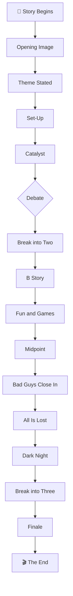

# 🎨 Story-Visualisierung - Architektur-Empfehlung

**Datum:** 2025-12-09  
**Kontext:** Visualisierung für Story-Planung (Outline/Beat Sheets)

---

## 🎯 EMPFEHLUNG: Hybrid-Ansatz

### **Architektur:**
```
┌─────────────┐
│   n8n       │  ← Workflow-Orchestrierung (BEHALTEN!)
│  (Port 5679)│     - Handler-Steuerung
└──────┬──────┘     - Prozess-Automation
       │
       ▼
┌─────────────────────────────────────┐
│   Django BF Agent                   │
│                                     │
│  ┌────────────────────────────────┐│
│  │ Outline Handlers               ││
│  │ - SaveTheCat                   ││
│  │ - Hero's Journey               ││
│  │ - Three-Act                    ││
│  └───────────┬────────────────────┘│
│              │                      │
│              ▼                      │
│  ┌────────────────────────────────┐│
│  │ OutlineVisualizer Service      ││  ← NEU!
│  │ - Mermaid.js Generation        ││
│  │ - HTML Export                  ││
│  │ - JSON for D3.js               ││
│  └───────────┬────────────────────┘│
└──────────────┼──────────────────────┘
               │
               ▼
┌──────────────────────────────────────┐
│   Frontend Rendering                 │
│  - Mermaid.js (in Browser)           │
│  - GitHub (native support)           │
│  - Export als PNG/SVG/PDF            │
└──────────────────────────────────────┘
```

---

## ✅ LÖSUNG 1: Mermaid.js (EMPFOHLEN!)

### **Warum Mermaid?**

**Pro:**
- ✅ **Text-basiert:** Einfach zu generieren und zu speichern
- ✅ **GitHub Native:** Zeigt automatisch in Markdown
- ✅ **Browser-Rendering:** Keine Server-Last
- ✅ **Flexibel:** Gantt, Timeline, Flowchart, Journey
- ✅ **Kostenlos:** Open Source, keine Lizenz
- ✅ **Export:** PNG, SVG, PDF möglich
- ✅ **Django Ready:** Einfache Integration

**Contra:**
- ⚠️ Weniger interaktiv als D3.js
- ⚠️ Begrenztes Styling

**Ideal für:**
- ✅ Outline-Visualisierung
- ✅ Beat-Sheet-Darstellung
- ✅ Chapter-Flow
- ✅ Story-Timeline

---

## 📊 MERMAID BEISPIELE

### **1. Save the Cat - Gantt Timeline**

```mermaid
gantt
    title Save the Cat Beat Sheet - Story Timeline
    dateFormat X
    axisFormat %s%%
    
    section Act 1 (25%)
    Opening Image           :0, 5
    Theme Stated           :5, 8
    Set-Up                 :8, 10
    Catalyst               :10, 17
    Debate                 :17, 25
    
    section Act 2 (50%)
    Break into Two         :25, 30
    B Story                :30, 40
    Fun and Games          :40, 50
    Midpoint              :50, 60
    Bad Guys Close In     :60, 75
    
    section Act 3 (25%)
    All Is Lost           :75, 80
    Dark Night            :80, 83
    Break into Three      :83, 92
    Finale                :92, 100
    Final Image           :100, 100
```


### **2. Hero's Journey - Emotional Arc**
```mermaid
journey
    title The Hero's Journey - Emotional Arc
    section Act 1: Departure
      Ordinary World: 3
      Call to Adventure: 4
      Refusal of Call: 2
      Meeting Mentor: 4
      Crossing Threshold: 5
    section Act 2: Initiation
      Tests & Allies: 3
      Approach Cave: 2
      Ordeal: 1
      Reward: 5
    section Act 3: Return
      Road Back: 3
      Resurrection: 1
      Return Elixir: 5
```

### **3. Story Flow - Flowchart**


---

## 💻 IMPLEMENTIERUNG

### **Service erstellt:** ✅
```python
# apps/writing_hub/services/outline_visualizer.py

from apps.writing_hub.services.outline_visualizer import visualize_outline

# Generiere Mermaid
mermaid_code = visualize_outline(outline_data, format='mermaid')

# Oder HTML
html = visualize_outline(outline_data, format='html')

# Oder JSON für D3.js
json_data = visualize_outline(outline_data, format='d3')
```

### **Verwendung:**
```python
from apps.writing_hub.handlers import EnhancedSaveTheCatOutlineHandler
from apps.writing_hub.services.outline_visualizer import visualize_outline

# 1. Generate outline
result = EnhancedSaveTheCatOutlineHandler.handle({
    'project_id': 123,
    'use_llm': True
})

# 2. Visualize
mermaid = visualize_outline(result, format='mermaid')

# 3. Save to project or display
project.outline_visualization = mermaid
project.save()
```

---

## 🔄 INTEGRATION MIT N8N

### **n8n orchestriert den Workflow:**

```
n8n Workflow:
┌──────────────────────────────────────────────┐
│ 1. User Input (Trigger)                      │
│    - Project ID                              │
│    - Framework (Save Cat, Hero, 3-Act)       │
│    - Options                                 │
└────────────────┬─────────────────────────────┘
                 │
                 ▼
┌──────────────────────────────────────────────┐
│ 2. HTTP Request to Django                    │
│    POST /api/writing-hub/generate-outline    │
│    → EnhancedSaveTheCatOutlineHandler        │
└────────────────┬─────────────────────────────┘
                 │
                 ▼
┌──────────────────────────────────────────────┐
│ 3. Outline erstellt (JSON Response)          │
│    - beats: [...]                            │
│    - outline: "..."                          │
└────────────────┬─────────────────────────────┘
                 │
                 ▼
┌──────────────────────────────────────────────┐
│ 4. HTTP Request to Django                    │
│    POST /api/writing-hub/visualize-outline   │
│    → OutlineVisualizer.generate_mermaid()    │
└────────────────┬─────────────────────────────┘
                 │
                 ▼
┌──────────────────────────────────────────────┐
│ 5. Visualization erstellt                    │
│    - mermaid_code                            │
│    - html_export                             │
└────────────────┬─────────────────────────────┘
                 │
                 ▼
┌──────────────────────────────────────────────┐
│ 6. Optional: Actions                         │
│    - Email mit HTML                          │
│    - Slack mit Link                          │
│    - Google Drive Upload                     │
│    - Notion/Confluence Export                │
└──────────────────────────────────────────────┘
```

### **n8n bleibt für:**
- ✅ Workflow-Steuerung
- ✅ Multi-Step-Prozesse
- ✅ External Integrations (Email, Slack, etc.)
- ✅ Scheduling & Automation

### **Mermaid macht:**
- ✅ Story-Visualisierung
- ✅ Timeline-Darstellung
- ✅ Beat-Sheet-Rendering

---

## 🎨 ALTERNATIVE: D3.js (Für Advanced Use)

### **Wenn du mehr Kontrolle brauchst:**

**Pro:**
- ✅ Hochgradig interaktiv
- ✅ Voll customizable
- ✅ Animationen möglich
- ✅ Zoom, Pan, Drag & Drop

**Contra:**
- ⚠️ Komplexer zu implementieren
- ⚠️ JavaScript-heavy
- ⚠️ Server-Side rendering schwieriger

**Best für:**
- Complex story structures
- Interactive editing
- Real-time collaboration
- Advanced features

**Service bereits vorbereitet:**
```python
json_data = visualize_outline(outline_data, format='d3')
# Returns JSON structure for D3.js
```

---

## 📦 ANDERE OPTIONEN (Für spezielle Use Cases)

### **Option A: Plotly (Python-based)**
**Pro:** Interaktiv, Python native, Export to HTML  
**Contra:** Overhead, nicht text-based  
**Use Case:** Wenn du Python-Charts willst

### **Option B: Graphviz/DOT**
**Pro:** Sehr flexibel, PDF/PNG export  
**Contra:** Komplexere Syntax  
**Use Case:** Wenn du sehr komplexe Graphs brauchst

### **Option C: Timeline.js**
**Pro:** Spezialisiert für Timelines  
**Contra:** Weniger flexibel  
**Use Case:** Nur für Timeline-View

### **Option D: Spezialisierte Story Tools**
- **Plottr:** Paid, GUI-based
- **yWriter:** Free, desktop app
- **Scrivener:** Paid, full writing suite

**Problem:** Alle external, keine API-Integration

---

## 🏆 FINALE EMPFEHLUNG

### **Für BF Agent:**

```
PRIMARY: Mermaid.js
  ├─ Gantt Charts (Save the Cat, 3-Act)
  ├─ Journey Diagrams (Hero's Journey)
  ├─ Flowcharts (Story Flow)
  └─ Timeline (Chapter Breakdown)

ORCHESTRATION: n8n (existing)
  ├─ Workflow coordination
  ├─ Multi-step processes
  └─ External integrations

OPTIONAL: D3.js
  └─ Advanced/Interactive features (future)
```

### **Implementation Path:**

**Phase 1: Mermaid Integration** ✅ (Created today!)
- Service: `outline_visualizer.py` ✅
- Formats: Mermaid, HTML, JSON ✅
- Django Views: TODO (next)

**Phase 2: Django Views & Templates**
- Create `/writing-hub/visualize/<project_id>/`
- Template with Mermaid.js CDN
- Export buttons (PNG, SVG, PDF)

**Phase 3: n8n Endpoints**
- REST API for n8n
- `/api/writing-hub/generate-outline`
- `/api/writing-hub/visualize-outline`

**Phase 4: Frontend Polish**
- Interactive controls
- Framework selector
- Real-time preview

**Phase 5 (Optional): D3.js**
- Advanced interactive features
- Real-time collaboration
- Drag & drop editing

---

## 💰 COST COMPARISON

### **Mermaid.js:**
- **Cost:** $0 (Open Source)
- **Hosting:** In-app (no external service)
- **Maintenance:** Low

### **D3.js:**
- **Cost:** $0 (Open Source)
- **Development:** Higher (more complex)
- **Maintenance:** Medium

### **External Tools (Plottr, etc.):**
- **Cost:** $49-199 (licenses)
- **Integration:** Difficult/Impossible
- **Maintenance:** N/A (external)

---

## 🎯 ZUSAMMENFASSUNG

### **Empfehlung:**

```
✅ Mermaid.js für Story-Visualisierung
✅ n8n für Workflow-Orchestrierung
✅ Hybrid-Ansatz für beste Ergebnisse
```

### **Warum nicht nur n8n?**

**n8n ist perfekt für:**
- ❌ Technische Workflows
- ❌ System-Integration
- ❌ Prozess-Automation

**n8n ist NICHT für:**
- ❌ Story-Struktur-Visualisierung
- ❌ Beat-Sheet-Darstellung
- ❌ Creative Content Display

### **Was macht Sinn:**

```
n8n orchestriert:
  "Generate outline" → Django Handler
  "Visualize outline" → Mermaid Service
  "Export & Share" → n8n integrations
```

---

## 📊 NÄCHSTE SCHRITTE

### **Sofort möglich:**
```python
from apps.writing_hub.services.outline_visualizer import visualize_outline

# Service ist bereits fertig!
result = handler.handle({'project_id': 123})
viz = visualize_outline(result, format='mermaid')
print(viz)  # Ready to display!
```

### **Für Production:**
1. Django View erstellen
2. Template mit Mermaid.js CDN
3. n8n Endpoints hinzufügen
4. Export-Funktionen (PNG, PDF)

---

## ✨ FAZIT

**Beste Lösung für BF Agent:**
- ✅ **Mermaid.js** für Visualisierung (text-based, einfach, flexibel)
- ✅ **n8n** für Orchestrierung (wie gehabt)
- ✅ **Django Service** als Bridge (bereits erstellt!)

**Status:** Service fertig, ready to use! 🚀

**Nächster Schritt:** Django Views + Templates für Frontend-Display

---

**Frage: Soll ich die Django Views + Templates auch noch erstellen?** 😊
