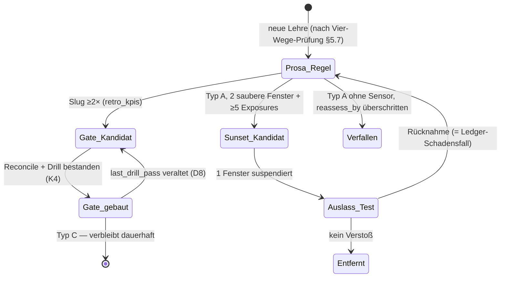

# KONZ-platform-038 — Regel-Lebenszyklus mit erzwungenem Evidenz-Ritual

**Tier-Entscheidung: T3** — org-weit (alle 3 Orgs), neue Boundary (Regel-Lebenszyklus),
persistente Artefakte, berührt den Security-Perimeter (Gates). Auto-Eskalation greift mehrfach;
keine Selbsteinstufungs-Frage.

## 1 Executive Summary

**Basis:** 55 Skills, 12 Policies, ~730 Memory-Regeln (52 % Drift-Lehren) — und trotzdem 18
gate-pflichtige Wiederholungs-Verstöße, Spitze ×34, unter dem aktuellen Modell (C1, C4, C5).
0/18 Gates fertig; für ~5 Slugs existiert Enforcement, das nachweislich feuert und trotzdem
nicht verhindert (C2, C6). **Analyse:** Der Engpass ist weder Regelmangel noch Modellschwäche,
sondern (a) fehlende Konversion Regel→wirksames Enforcement und (b) fehlender Rückbau-Pfad —
die Ratsche kennt nur eine Richtung. **Fazit:** Gebraucht wird ein geschlossener Regelkreis:
klassifizieren → wirksam durchsetzen (mit Wirksamkeits-Beweis) → messen (erzwungen, 14-Tage) →
zurückbauen (evidenzbasiert). **Handlungsempfehlung:** Welle-1-Gates bauen (Reconcile+Drill,
§12 D2), Ritual per Cron erzwingen (D3), Klassifikation in die Regel-Quellen schreiben (D4) —
Entscheidungen ungebündelt in §12.

## 2 Scope & Evidenzbasis

Scope: alle 3 Orgs (achimdehnert, ttz-lif, meiki-lra); Gov-Detailbefunde bleiben in den
Gov-Repos. Evidenz: siehe `evidence_manifest` (alle Quellen in der Session vom 2026-08-02
geöffnet/ausgeführt); Zusammenfassung im Phase-1-Report (`~/.claude/boards/
lotse-phase1-bestandsaufnahme.md`, via Loopback-Dienst lesbar). Nicht verifiziert:
Retro-Abdeckungsquote (wie viele Sessions OHNE Retro enden) — billigster Check: Session-Count
aus `~/.claude/projects/*` gegen Retro-Count je 14-Tage-Fenster (erste Ritual-Aufgabe).

## 3 Infrastruktur-Fit (SSoT-Prüfung)

Wiederverwendet, nichts Neues erfunden: `retro_kpis.py` (Sensor + `--file-issues`),
Hook-Schichten (PreToolUse/Stop/SessionStart), `cc-skill-dist` (Verteilung), KONZ-Lifecycle
(dieses Doc), `autonomy-gates.md` (Freigabe-Rahmen), Lotsen-Charta (Selbstbetroffenheits-Regel).
**Keine vierte Wahrheit:** A/B/C-Label leben IN der jeweiligen Regel-Quelle
(Memory-Frontmatter, Policy-Frontmatter), nie in einer Separatliste (§6 AD-3). Einziges neues
Artefakt: ein append-only Sunset-Ledger (`docs/governance/sunset-ledger.md`) — Ereignis-Log,
keine Regel-Quelle, daher keine SSoT-Kollision.

## 4 Steelman (Synthese des unabhängigen Reviews)

Das Konzept ist der erste Vorschlag, der die Regel-**Produktion** selbst unter Evidenzpflicht
stellt und einen Abbaupfad definiert — es ersetzt „Fehler → neue Regel → Hoffnung" durch einen
falsifizierbaren Regelkreis. Stärkste Stützen: (a) die quantifizierte Enforcement-Lücke
(0/18, risiko_debt 2.54 als schwächste Score-Dimension), (b) „Reconcile vor Neubau" ist durch
die Hook-Inventur direkt begründet (sonst entstehen 18 neue Gates neben 5 wirkungslosen alten),
(c) der Modellwechsel-Trigger ist geerdet (52 % Drift-Lehren unbekannten Verfallsdatums bei
~3-monatigen Modellwechseln). Ehrliche Grenze: Das Konzept baut selbst kein Gate und erklärt
nicht abschließend, ob der Top-Slug überhaupt vollständig hookbar ist (§7).

## 5 Konzeptdefinition

### 5.1 Klassifikation A/B/C — in der Regel-Quelle
Jede Regel erhält in ihrer Quelle (Memory-/Policy-Frontmatter): `rule_class: A|B|C`,
`assessed_with: <model-id>`, `reassess_by: <Datum>`.
**A** = Modell-Schwäche-Kompensation → sunset-fähig. **B** = Org-Präferenz → modell-unabhängig,
bleibt. **C** = Irreversibilitäts-/Security-Gate → bleibt unabhängig von Modellgüte; nie
sunset-fähig. Grenzfälle A/C werden als C geführt (konservativ).

**Entscheidungskriterien mit Ankerbeispielen** (EXT1-AD-5 — Inter-Reviewer-Konsistenz):
Frage 1: „Würde ein fehlerfreies Modell die Regel überflüssig machen?" Ja → A-Kandidat
(Bsp.: Pre-Send-Zellen-Zählung im Action Board). Nein → Frage 2: „Schützt sie vor
irreversiblem/externem Schaden (Prod, Publish, Secrets, Dritte)?" Ja → C (Bsp.: Secrets nie
im Klartext). Nein → B (Bsp.: Commit-Message-Format). Wer bei Frage 1 zögert → C-konservativ.

### 5.2 Gate-Bau: Reconcile → Drill → Bau
Reihenfolge nach Verstoßzähler × Schadensklasse. Pro Slug PFLICHT-Sequenz:
1. **Reconcile:** Was existiert schon (Hook/CI/Skill-Phase)? Warum wirkt es nicht
   (advisory statt blockierend? falscher Zeitpunkt im Ablauf? Coverage-Lücke?).
2. **Drill:** provozierter Verstoß muss nachweislich blocken/melden („Rückspielprobe").
   **Ein Gate ohne bestandenen Drill gilt als NICHT gebaut** (§13 K4).
3. **Bau/Härtung** mit expliziter Einstufung `blocking | advisory` im Gate-Header.
Hooks werden git-getrackt (platform) verteilt, nicht nur maschinen-lokal gepflegt (§6 M-2).

### 5.3 14-Tage-Ritual — erzwungen, nicht vorgenommen
Trigger: **GitHub-Actions-Schedule** (2. + 16. des Monats, `.github/workflows/regel-ritual.yml`,
PR #1641) — bewusst off-host statt Maschinen-Cron; Aufsicht und Ausführung teilen nicht den
Dev-Server-Ausfall (EXT2-M28-1). Rest-Risiko „Schedule feuert still nicht" (z. B.
GitHub-Inaktivitäts-Abschaltung): der jeweils nächste Lauf prüft das Datum des letzten
Kommentars auf #1640 und meldet Lücken >20 Tage als eigenen Befund. Der Lauf kommentiert
ausschließlich auf das EINE fixe Tracking-Issue (kein Issue-Anlegen, 2×/Monat — Flut-Risiko
strukturell begrenzt, EXT2-AD-10; die Bezeichnung „report-only" wird nicht mehr verwendet,
der Kommentar IST ein Schreibpfad). Inhalt je Lauf:
`retro_kpis`-Delta; neue Slugs ≥2 → Issue via `--file-issues`; Gate-Backlog-Stand;
Sunset-Prüfung (§5.4). **Input-Bedingung:** ≥8 Retros im Fenster, sonst Ergebnis
„nicht bewertbar" (zählt nie als „stagniert/sauber", §6 AD-6/M-7). **Ausfallregel:** 2
verpasste Fenster in Folge ⇒ Konzept-Status automatisch → `stale` + Issue (§6 M-3).
1-Seiten-Runbook, damit jeder Dritte den Lauf fahren kann.

### 5.4 Sunset — zwei Pfade statt einem
**Pfad 1 (Evidenz-Sunset, nur instrumentierte Regeln):** Typ-A-Regel mit Sensor wird
Sunset-Kandidat erst bei: 2 aufeinanderfolgende saubere Fenster **UND** ≥5 Exposures
(Situationen, in denen die Regel hätte greifen können — Exposure-Nenner statt Kalenderzeit,
§6 AD-4). Dann kontrollierter Auslass-Test (1 Fenster). **Pfad 2 (Default-Expiry, der
nicht-instrumentierte Long Tail — EXT2-AD-7):** Für die ~700 Regeln ohne Sensor ist Pfad 1
nicht ausführbar (Exposure eines Nicht-Ereignisses ist ohne Sensor nicht erhebbar). Dort
**greift** `reassess_by`: Typ-A-Regel, die am Stichtag nicht mit einer Zeile erneuert wird,
verfällt (Semantik-Wechsel von „erinnern" zu „greifen"). Typ B/C sind von beiden Pfaden
ausgenommen. Jede Rücknahme = realer Schadensfall, wird im Sunset-Ledger geführt
(append-only, je Eintrag mit Regel-Referenz + Begründung — EXT2-M28-6).

### 5.7 Vier-Wege-Prüfung vor jeder neuen Regel (Owner-Input 2026-08-02)
Frontier-Labore verbessern Agenten primär über Rückkopplungsschleifen (Daten, Evals,
Werkzeuge, Inferenz-Ablauf), kaum über zusätzliche Verhaltensregeln. Analog gilt ab jetzt vor
jeder neuen Regel die Pflichtfrage: Löst das Problem besser **(1) ein Werkzeug** (Hook/Check,
der die Fehlerklasse strukturell unmöglich macht), **(2) eine Evaluation** (Messung, die
Drift sichtbar macht), **(3) eine Ablauf-Änderung** (anderer Prozessschritt) — oder wirklich
**(4) eine Regel** (letztes Mittel, nur wenn 1–3 nicht greifen)? Die Antwort wird im
Artefakt der Regel dokumentiert. Deckt sich mit EXT2-OOTB-1/2: das Ritual ist der Sache nach
ein kleines Eval-/Post-Training-System auf Governance-Ebene — investiert wird vorrangig in
den Sensor (KPI-Härtung), die Werkzeuge (blockierende Hooks) und den Ablauf, nicht in
Regeltext.

### 5.5 Skills-Nachrang mit Zaun
Solange die Welle-1-Gates (D2) nicht Drill-bestanden sind: keine neuen Skill-PRs außer mit
wörtlichem Owner-Override (der geloggt wird). Enforcement ehrlich benannt: Stufe 1 =
Review-Checkliste (Review-Gate, kein Exit-Code); Stufe 2 (nach Welle 1) = CI-Check
„Skill-Datei neu + Gate-Backlog-Top-5 offen → rot". Bis Stufe 2 existiert, ist dieser Zaun
formal umgehbar (§6 AD-5/M-4) — bewusste Übergangs-Schwäche, befristet bis 2026-09-13.

### 5.6 Modellwechsel-Trigger — event-basiert
SessionStart-Hook vergleicht aktuelle Modell-ID gegen `~/.claude/hooks/state/model-id`;
bei Änderung: Hinweis + Smoke-Kalibrier-Suite (kleine Aufgaben mit bekannter Antwort) +
Re-Assessment-Pflicht aller A-Labels (`assessed_with` veraltet). Kein Kalender-Raten (§6 M-6).

## 6 Adversariale Analyse (3 unabhängige Agenten, sahen einander nicht)

Einwände vollständig übernommen und in §5 eingebaut:

| ID | Einwand (Kurz) | Antwort im Konzept |
|---|---|---|
| AD-1 | Ritual = Merksatz, Selbstwiderspruch | Cron-Zwang + Ausfall-Flip auf `stale` (§5.3) |
| AD-2 | „Gates senken Zähler" falsifiziert (Hook feuert, ×34 trotzdem) | blocking/advisory-Pflicht + Drill; Diagnose §7 |
| AD-3 | A/B/C = vierte Wahrheit | Labels in Regel-Quelle, keine Separatliste (§5.1) |
| AD-4 | Sunset misst Abwesenheit | Exposure-Nenner ≥5 (§5.4) |
| AD-5 | „Skills nachrangig" umgehbar | Zaun + Override-Log; Übergangs-Schwäche befristet (§5.5) |
| AD-6 | Zirkuläre Messbasis (Retro-Selbstauskunft) | Input-Bedingung + Abdeckungs-Messung (§2, §5.3) |
| AD-7 | Kill-Schwellen bei kleinem N Rauschen | Mindest-N (K3: N≥5) + „nicht bewertbar"-Zustand |
| M-1 | KPI-Parser einziger Sensor, drift-anfällig | Golden-Fixture-Test + Fail-on-unknown (D6); Beleg C7 |
| M-2 | Enforcement maschinen-lokal | Hooks git-getrackt verteilen (§5.2); teils schon so (43d8eaa2) |
| M-3 | Single-Owner-Ritual ohne Ausfallregel | Ausfall-Flip + Runbook (§5.3) |
| M-4 | Skills-Nachrang heute schon widerlegt | WIP-Zaun Stufe 2 als CI-Check (§5.5) |
| M-5 | A/B/C-Labels altern stumm | `assessed_with` + `reassess_by` + Re-Assessment bei Modellwechsel (§5.1/5.6) |
| M-6 | Kalender-Trigger skaliert nicht | Event-Trigger Modell-ID-Vergleich (§5.6) |
| M-7 | Sensor-Tod sieht aus wie Erfolg | „nicht bewertbar" statt „stagniert" (§5.3, K1) |
| M-8 | Reconcile prüft Existenz, nicht Wirkung | Drill-Pflicht als Bau-Definition (§5.2, K4) |

**Konfliktmatrix (Pflicht):** Ein echter Dissens: Steelman hält die A/B/C-Klassifikation für
den konzeptionellen Kern; Diabolus hält sie für sekundär gegenüber Enforcement (AD-1/AD-2).
**Auflösung:** Owner-Entscheid „Gate-Bau zuerst" (2026-08-02) — Klassifikation läuft parallel
als billige Frontmatter-Pflege, blockiert nichts. Übrige Befunde konvergieren
(Code-statt-Prosa, Wirkung-statt-Existenz, Messbasis-Härtung) — keine weiteren Divergenzen.

## 7 Deep-Dive: das ×34-Paradox (Hook feuert, Verstoß bleibt Spitzenreiter)

Befund (C2, C6): `evidence_claim_scanner.py` existiert seit Juni (Reaktion auf Vorfall
2026-06-01), ist git-getrackt, feuerte in dieser Session nachweislich — und
`claim-before-cheapest-check` ist trotzdem ×34, zuletzt 31.07. **Diagnose:** Der Hook ist (a)
**advisory** (hängt eine Erinnerung an, blockt nicht) und (b) ein **Stop-Hook** — er feuert
NACH dem Absenden der Behauptung. Er ist konstruktionsbedingt Reparatur, nicht Prävention
(heute live beobachtet: Behauptung raus → Hook → Korrektur-Turn). **Konsequenz für D2:** Der
Slug ist im Sendemoment vermutlich nicht vollständig hookbar; das Gate braucht eine zweite,
blockierende Ebene am nächsten harten Artefakt-Übergang — PR-Ebene: CI-Check „PR-Body
behauptet Testergebnis/Status ohne verlinkten Run" → rot. **Hypothese-Kennzeichnung:** Ob
die PR-Ebene die Verstoß-Klasse messbar senkt, ist unverifiziert — genau dafür misst K1.

## 8 Alternativen (geprüft, verworfen)

| Alternative | Warum verworfen |
|---|---|
| Status quo (Regel-Akkretion weiter) | Empirisch scheiternd: ×34 bei wachsendem Bestand; risiko_debt 2.54 |
| „Modell vertrauen, Regeln radikal löschen" | Juli-Evidenz: aktuelle Modell-Ära verstößt weiter; C-Gates dürfen nie modellabhängig sein |
| Nur Gates bauen, kein Sunset/Ritual | Ratsche bleibt einseitig; Bestand wächst monoton (+14 Skills/Monat), Pflegekosten komponieren |

## 9 Out-of-the-Box

- **Verstöße pro Exposure** als Standard-KPI statt Rohzähler (macht Fenster vergleichbar).
- **Regel = Hypothese mit Halbwertszeit:** jede neue Typ-A-Regel entsteht ab jetzt MIT
  `reassess_by` — Regeln ohne Verfallsprüfung sind der Ausnahmefall, nicht der Normalfall.
- **Gate-Drill als wiederkehrender CI-Lauf** (nicht nur beim Bau): toter Hook wird binnen
  eines Fensters entdeckt statt 2028 (M-8 dauerhaft beantwortet).

## 10 Befunde

| ID | Befund | Evidenz |
|---|---|---|
| B-1 | 0/18 Gates gebaut; 7 Slugs waren ohne Tracking-Issue (02.08. nachgeholt #1631–#1638) | E3 (C3) |
| B-2 | Partielles Enforcement für ~5 Slugs existiert, überwiegend advisory | E2 (C2) |
| B-3 | Top-Slug ×34 überspannt die Hook-Ära → Repair-not-Prevention | E2/E3 (C1, C6) |
| B-4 | KPI-Parser zählt 3 Artefakt-Slugs aus Retro a50bc6 mit | E2 (C7) |
| B-5 | Regelbestand wächst monoton: +14 Skills allein Juli | E2 (C4) |
| B-6 | Ritual ohne Cron-Zwang wäre Merksatz Nr. 731 | D (Alternative: Kalender-Vorsatz — verworfen, AD-1) |

## 11 Top-5-Risiken

| # | Risiko | Gegenmaßnahme |
|---|---|---|
| R1 | Ritual verhungert (Owner-Ausfall, Incident-Vorrang) | Cron + Ausfall-Flip `stale` + Runbook (K2) |
| R2 | Sunset trifft Falsche (Abwesenheit ≠ Wirkung; A/C-Fehleinstufung) | Exposure-Nenner, konservative C-Einstufung, Ledger (K3) |
| R3 | Label-Drift (vierte Wahrheit, Alterung) | Labels nur in Regel-Quelle + `assessed_with`/`reassess_by` |
| R4 | Sensor-Tod maskiert als Erfolg | Input-Bedingung ≥8 Retros; „nicht bewertbar"-Zustand (K1) |
| R5 | Zaun-Umgehung (Skills wachsen weiter) | Override nur wörtlich + geloggt; Stufe-2-CI bis 13.09. (K-Prüfung) |

## 12 Empfehlungen (ungebündelt — jede einzeln entscheidbar)

| ID | Empfehlung | Charakter | Owner-Entscheid nötig? |
|---|---|---|---|
| D1 | Dieses KONZ reviewen/mergen | Governance | Ja (manueller Merge) |
| D2 | Gate-Welle 1, umgebaut (EXT2-AD-5/AD-8): für claim-before-cheapest-check ZUERST zwei kostenlose Vorabtests — (a) Replay der geplanten Prüfregel gegen die 34 historischen Vorkommen (Abdeckungsquote = Wirkungsobergrenze), (b) evidence_claim_scanner von advisory auf blockierend (Stop-Hook Exit 2 = erzwungener Korrektur-Turn, optional mit Evidenz-Token-Formvertrag EXT2-OOTB-2) + EIN Fenster messen. PR-CI-Ebene erst, wenn (b) die Rate nicht senkt. Danach handover-stale, scope-checkpoint, stale-clone (Drill des existierenden Checks!), deferred-item-no-tracking | Ausführung, gate-frei bis auf Hook-Verteilung | Reihenfolge-OK genügt |
| D3 | Ritual-Trigger als Actions-Schedule (PR #1641, kommentiert NUR auf fixes Issue #1640; Lücken-Selbstprüfung §5.3) | Automatismus mit begrenztem Schreibpfad | Kenntnisnahme; Abschaltung jederzeit |
| D4 | A/B/C-Frontmatter-Rollout NUR platform (148 Einträge); Fleet erst nach org-weitem ADR-Entscheid (EXT2-AD-9) | Pflege, gate-frei | Nein |
| D5 | Skills-WIP-Zaun Stufe 1 sofort, Stufe 2 als CI nach Welle 1; der Zaun trägt ein **mechanisches** Ablaufdatum 2026-09-13 (Frontmatter-Feld, das der Ritual-Lauf prüft und bei Überschreitung als Befund meldet — Zusage wird Mechanismus, EXT2-M28-4) | **Selbstbetreffend: schränkt MICH ein** | Ja (bewusste Selbstbindung) |
| D6 | retro_kpis-Härtung VOR der Baseline (EXT2-AD-3): Golden-Fixture, Fail-on-unknown, a50bc6-Parser-Fix; Baseline wird mit gepinnter Tool-Version berechnet und als committetes Artefakt inkl. Tool-Commit-Hash abgelegt; Instrumentenwechsel ⇒ Baseline-Neuberechnung. Zusätzlich: kanonisches Slug-Wörterbuch der Baseline-Top-Slugs einfrieren + committen; unmappbare neue Slugs = „nicht bewertbar", nie „neu" (EXT2-AD-2) | Ausführung, gate-frei | Nein |
| D7 | Modellwechsel-Detektor (SessionStart, model-id-State) + Smoke-Suite; Re-Assessment bei Modellwechsel begrenzt auf A-Regeln mit Exposure im letzten Fenster, `reassess_by` gestaffelt statt kohortenweise (EXT2-M28-3) | Ausführung, gate-frei | Nein |
| D8 | Wiederkehrender Drill (aus §9 in Entscheid gehoben, EXT2-M28-2): jedes Gate trägt maschinenlesbaren Header (slug, mode: blocking\|advisory, owner, last_drill_pass); ein Prüf-Lauf je Fenster stuft Gates mit veraltetem last_drill_pass K4-konform auf „nicht gebaut" zurück. Blocking-Gates mit Formulierungs-Konvention (stderr = Maschinen-Feedback, nicht Ablehnung) + Drill-Fall „Agent bricht Turn ab statt zu korrigieren" (EXT2-M28-5) | Ausführung, gate-frei | Nein |

**Ausdrücklich NICHT in diesem KONZ:** Autonomie-Erweiterungen (neue SA-Klassen,
Gate-Absenkungen). Die werden — Charta Punkt 3 — erst NACH Drill-bestandener Welle 1 + einem
sauberen Ritual-Zyklus einzeln vorgeschlagen, jeweils markiert „erweitert meine Macht".

## 13 Entscheidung + Kill-Gate + 30/60/90

Empfehlung: D1–D7 wie oben; Pilot = 3 Ritual-Zyklen (16.08., 02.09., 16.09.); ADR-Entscheid
erst danach.

**Kill-Gate-Kriterien (K1/K3 neu gefasst nach externem Review — Begründung §14):**
- **K1 (dreistufig, vorab registriert — EXT2-AD-1):** Nach 3 Zyklen (Stichtag 2026-09-16),
  gemessen als normalisierte Verstoßrate (Verstöße/Retro) der eingefrorenen Baseline-Top-3
  (Slug-Wörterbuch D6) vs. Baseline-Fenster 19.07.–01.08.:
  **wirksam** = Rate ≥30 % unter Baseline ⇒ NUR dieser Ausgang löst ADR-Reife aus ·
  **unentschieden** = nicht gestiegen, aber <30 % Senkung ⇒ Pilot läuft weiter, KEIN ADR ·
  **Kill** = Rate gestiegen ⇒ Überarbeitung mit hartem Scope-Cut.
  Fenster mit <8 Retros = „nicht bewertbar" (zählt für keinen der drei Ausgänge).
  Benannter Confounder (EXT2-AD-4): D5 verschiebt die Session-Zusammensetzung und damit die
  Exposure je Retro — bei der Auswertung ausweisen.
- **K2:** 2 aufeinanderfolgende Fenster ohne Ritual-Lauf ⇒ `pipeline_status: stale` +
  Auto-Issue. Kein drittes Fenster ohne Owner-Entscheid.
- **K3 (symmetrisch kalibriert — EXT2-AD-6):** Die ersten 2 Sunset-Rücknahmen gelten als
  deklarierte Lernphase; danach: >30 % Rücknahmen bei N≥10 ⇒ Sunset-Pfad eingefroren. Jede
  Rücknahme bleibt ein realer Schadensfall im Ledger — die Symmetrie verhindert nur, dass der
  reduzierende Pfad eine härtere Beweislast trägt als der akkretierende.
- **K4:** Gate ohne bestandenen Negativ-Drill zählt in jeder Metrik als NICHT gebaut;
  veralteter `last_drill_pass` (D8) stuft zurück auf „nicht gebaut".
- **K5 (Meta-Kill — EXT1-M28-5/EXT1-AD-1):** Das Ritual selbst muss je Quartal (a) einen
  Outcome-Indikator AUSSERHALB der Governance ausweisen — Folge-Fix-Quote: Anteil gemergter
  PRs, die binnen 14 Tagen einen Korrektur-PR im selben Bereich brauchen (aus gh/git
  erhebbar) — und (b) sein Aufwand/Nutzen-Verhältnis begründen. Zwei Quartale ohne
  Outcome-Verbesserung bei wachsendem Meta-Aufwand ⇒ Ritual verschlanken oder killen. Die
  Governance-Artefakte (Ledger, Zaun, Workflow, Drills) unterliegen derselben
  Ritual-Prüfung wie Regeln (EXT2-M28-4); ausgenommen von rekursiver Governance sind
  B-Regeln und reine Doku (EXT1-M28-3).

**Tracking-Tabelle (Pflicht §13):**

| Kriterium | Status | Beleg |
|---|---|---|
| K1 dreistufig: Baseline eingefroren (Tool gepinnt + Slug-Wörterbuch) | **erfüllt 2026-08-02** | docs/governance/k1-baseline/ (n=20, Summen-Rate 1.000, Schwellen 0.700/1.000; Tool-Suite 23/23) |
| K2 Ritual-Ausfallregel aktiv | erfüllt 2026-08-02 | PR #1641 gemergt, scharfer Lauf auf #1640 bewiesen |
| K3 Sunset-Ledger existiert, 0 Einträge, Lernphasen-Zähler 0/2 | offen | — |
| K4 Drill-Protokoll je Welle-1-Gate | erfüllt 2026-08-02 (5/5 Welle 1) | GATE_HEADER + Drill-Tests in PRs #1643–#1648 |
| K5 Outcome-Indikator (Folge-Fix-Quote) erstmalig erhoben | offen | — (Quartalstermin 2026-11-01) |
| D5-Zaun-Ablaufdatum mechanisch geprüft | offen | — (Ritual-Lauf prüft Frontmatter-Feld) |
| D4 A/B/C-Frontmatter-Rollout (148 platform-Einträge) | **offen** | — (Retro 287b23 #3: 0 `rule_class:`-Treffer; fehlte hier — Zeile nachgetragen, Claim in PR-#1658-Kommentar korrigiert) |

**30/60/90:** 30 Tage = Welle-1-Vorabtests + Gates + Zyklen 1–2 + Baseline; 60 Tage = erste
Sunset-Kandidaten-Bewertung (platform-Labels; Fleet erst nach ADR — EXT2-AD-9); 90 Tage =
ADR-Entscheid NUR bei K1-Ausgang „wirksam", sonst Weiterlauf oder Kill.

**Regelkreis als Zustandsdiagramm (EXT1-REC-5):**

## 14 Rückfluss externes Review (2026-08-02, 2 unabhängige externe LLM-Reviews)

Audit: 2 externe Anbieter-Reviews (Transport via /adr-handoff-extern, Briefing
`adr-handoff-KONZ-platform-038-2026-08-02.md`; Anbieter-Namen trägt der Owner nach). Beide
Verdikte: **überarbeiten** — eingearbeitet in dieser Fassung. ID-Namespace: `EXT1-*` =
Review 1, `EXT2-*` = Review 2 (Kollision der Persona-Präfixe mit §6-internen IDs — Prozess-Fix
am Handoff-Skill getrackt, EXT2-REC-13).

**Tag-Tabelle (nur [valid] floss ein, jeweils mit eigener Begründung):**

| ID | Verdikt | Aktion |
|---|---|---|
| EXT1-AD-1 (Outcome-KPI fehlt) | valid | K5(a) Folge-Fix-Quote |
| EXT1-AD-2 (Self-Measurement-Bias) | valid | quartalsweise externe Zweitmeinung auf die K1-Auswertung (dieses Handoff-Format) |
| EXT1-AD-3 (Overhead ohne Nutzen-Nachweis) | valid | K5(b) Aufwand/Nutzen-Pflicht |
| EXT1-AD-4 (Kosten je Regel) | teilweise | nur für Gates (Header/Drill-Kosten); Feld für alle ~730 Regeln wäre selbst ungedeckter Meta-Aufwand |
| EXT1-AD-5 (A/B/C-Konsistenz) | valid | §5.1 Ankerbeispiele |
| EXT1-M28-1 (Meta-Artefakt-Wartung) | valid | K5 Selbstanwendung |
| EXT1-M28-2 (Zustandsautomaten) | teilweise | Diagramm §13; separate Doku erst bei Bedarf |
| EXT1-M28-3 (rekursive Governance) | valid | K5: B-Regeln + Doku ausgenommen |
| EXT1-M28-4 (lokale Evidenz) | valid | Hooks git-getrackt (§5.2, bereits geplant); Reports git/Issues |
| EXT1-M28-5 (Ritual-Selbstzweck) | valid | K5 Meta-Kill |
| EXT2-AD-1 (K1 nicht falsifizierbar) | valid | K1 dreistufig, 30 %-Schwelle vorab registriert |
| EXT2-AD-2 (Slug-Goodhart) | valid | D6 Slug-Wörterbuch einfrieren |
| EXT2-AD-3 (Instrumentenwechsel) | valid | D6 vor Baseline, Tool gepinnt, Artefakt committet |
| EXT2-AD-4 (Exposure in K1) | valid | Confounder benannt in K1 (voller Nenner zu teuer) |
| EXT2-AD-5 (Replay-Vorabtest fehlt) | valid | D2(a) — der Befund trifft: das Konzept beging den eigenen Slug |
| EXT2-AD-6 (Kill-Asymmetrie) | valid | K3 neu: Lernphase + N≥10 |
| EXT2-AD-7 (Sunset für Long Tail unausführbar) | valid | §5.4 Pfad 2 Default-Expiry |
| EXT2-AD-8 (Hook advisory per Konfig, nicht Konstruktion) | valid | D2(b) blockierend + 1 Fenster messen VOR PR-Ebene |
| EXT2-AD-9 (Fleet vor ADR) | valid | D4 platform-only |
| EXT2-AD-10 (D3-Schreibpfad) | teilweise | Implementierung kommentiert nur auf fixes Issue (keine Issue-Erzeugung); Wortlaut „report-only" gestrichen |
| EXT2-M28-1 (K2 Selbstüberwachung) | teilweise | Ausführung ist bereits off-host (Actions, #1641); Rest-Risiko still-toter Schedule → Lücken-Selbstprüfung §5.3 |
| EXT2-M28-2 (kein Lebendigkeits-Drill) | valid | D8 neu |
| EXT2-M28-3 (Re-Assessment-Aufwand) | valid | D7 gestaffelt + exposure-begrenzt |
| EXT2-M28-4 (keine Rückbau-Pfade für Meta) | valid | K5 + D5-Ablaufdatum mechanisch |
| EXT2-M28-5 (Blocking-Hook-Stall-Risiko) | valid | D8 Formulierungs-Konvention + Drill-Fall |
| EXT2-M28-6 (Ledger ohne Rückindex) | valid | §5.4 Regel-Referenz je Eintrag |
| EXT2-REC-13 (ID-Namespace) | valid | Prozess-Issue am Handoff-Skill |
| EXT2-OOTB-2 (Evidenz-Token-Formvertrag) | valid | D2(b)-Option — stärkster Welle-1-Kandidat |
| EXT2-OOTB-1/3 (Checks-as-Code / pre-commit) | teilweise | Framing für §5.2 übernommen; ersetzt Hook-Ebene nicht |
| EXT2-OOTB-4 (Typ-A-Bestand aussetzen) | out-of-scope | wie vom Reviewer selbst verworfen; abgeschwächte Form = Pfad 2 |
| EXT1-OOTB (Governance-Budget one-in-one-out) | teilweise | als Zukunftsoption notiert, nicht übernommen (C-Regeln nicht tauschbar) |
