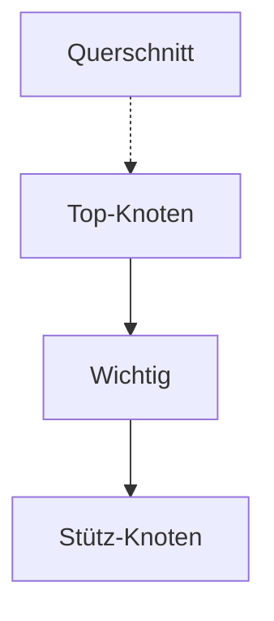

# IIL Print Agent — Authoring Guide

Wie man Markdown schreibt, damit das Print-Agent-PDF **professionell aussieht**.
SSoT für alle Repos. Stand: 2026-05-14.

---

## 1 Kopf jedes Dokuments

Setze diese Meta-Felder **direkt unter dem `# Titel`** als Bold-Prefix-Zeilen.
Sie landen automatisch in der Cover-Meta-Tabelle und werden aus dem Body entfernt
— der Cover muss nicht noch einmal im Text wiederholt werden.

```markdown
# Mein Konzept

**Typ:** Konzept
**Status:** Entscheidungsvorlage
**Datum:** 2026-05-14
**Adressat:** Geschäftsführung
**Zielentscheidung:** Provider X oder Y
**Anlass:** Workshop am 21.05.

(Body startet hier)
```

**Wirkung:**
- `Typ:` → Cover-Untertitel statt "Angebot · DATUM" (default: "Dokument").
- Alle Felder landen in der Meta-Tabelle (rechts) auf Cover-Seite.
- Bold-Prefix-Zeilen werden **automatisch** aus dem Body gestrippt.

**Unterstützte Keys:**
`Typ`, `Status`, `Datum`, `Adressat`, `Zielentscheidung`, `Anlass`,
`Autor`/`Autorin`, `Gültig bis`, `Auftraggeber`, `Angebot Nr.`, `Zielgruppe`,
`Stand`, `Begleitdokument`.

---

## 2 Inhaltsverzeichnis

Setze einfach `[TOC]` an die Stelle, an der das Inhaltsverzeichnis erscheinen soll
— meist direkt nach Meta-Block oder Executive Summary.

```markdown
[TOC]
```

Wird zu einem gestylten Inhaltsverzeichnis mit allen H2/H3-Headings expandiert,
mit Hyperlinks im PDF.

---

## 3 Die richtige Visualisierung pro Inhaltstyp

| Inhalt | Verwende NICHT | Verwende stattdessen |
|---|---|---|
| Prozess-Flow (Linear/Verzweigung) | ASCII-Boxen `┌──┐` | ` ```mermaid ` Flowchart |
| Pro vs. Contra | Bullet-Liste mit `**Pro:** -` | ` ```compare ` DSL |
| Tier-/Schwellen-Entscheidung | Numerierte Liste | ` ```tiers ` DSL |
| Architektur-Pipeline | ASCII | ` ```arch ` DSL **oder** Mermaid |
| Schichtenmodell | ASCII | ` ```layer ` DSL |
| Zeitplan / Roadmap | Tabelle | ` ```gantt ` DSL |
| Verzeichnis-/Datei-Struktur | inline `code` | ` ```tree ` DSL |
| Workflow mit Entscheidungsknoten | Bullet-Beschreibung | ` ```flow ` DSL **oder** Mermaid |
| Hinweis / Warnung / Info-Box | `**Hinweis:**` im Fließtext | `> **Hinweis:** ...` (Blockquote) |
| Bis 5 Spalten Vergleich | (Standard-Tabelle) | Standard-Tabelle |
| Mehr als 5 Spalten | Tabelle voll | ` ```compare ` oder Doppel-Tabelle |

---

## 4 DSL-Referenz

### 4.1 `mermaid` — der Allzweck-Diagramm

Empfehlung: für 95% aller Diagramme.

```markdown
\`\`\`mermaid
flowchart LR
    A[Start] --> B{Entscheidung}
    B -- "ja" --> C[Aktion A]
    B -- "nein" --> D[Aktion B]
    style B fill:#1A3A5C,color:#fff
\`\`\`
```

**Regeln:**
- Maximal ~10 Knoten pro Diagramm — sonst splitten.
- `LR` für ≤5 Knoten (horizontal), `TD` für tiefere Flüsse (vertikal).
- Multi-Line-Labels mit `<br/>` (keine `\n`).
- Bold im Label: `<b>Text</b>`.

**Theme aus Design-YAML — keine `classDef`-Blöcke in der MD:**
Statt Farben hart zu codieren, eine der vier semantischen Tier-Klassen anhängen.
Der `print_agent` injiziert die `classDef`-Zeilen aus `print_designs.yaml`
zur Renderzeit — die MD bleibt sauber, und ein Design-Wechsel
(`--design meiki|iil|ttz`) färbt automatisch um.



| Klasse    | Verwendung                          |
|-----------|-------------------------------------|
| `:::primary` | Headline-Knoten, Gesamtsystem    |
| `:::accent`  | Pflicht-/Kern-Bausteine          |
| `:::support` | unterstützende Bausteine, Daten  |
| `:::muted`   | Querschnitt, Hintergrund-Konzepte |

**Override:** Wer einen einzelnen Knoten anders färben will, nutzt
weiterhin `style NODE fill:#...,color:#...`. Eigene `classDef`-Zeilen
in der MD gewinnen gegen die Injection (Author wins).

**Größen-Hint:** Wenn ein Mermaid-Diagramm im PDF zu klein wirkt, breche es in 2
Diagramme auf (z. B. linker und rechter Teil), statt mehr Knoten hineinzupacken.

### 4.2 `tiers` — farbcodierte Tier-/Schwellen-Listen

```markdown
\`\`\`tiers
tier1 | Hard Block | Score ≥0.95 ODER ID-Match | sofortige Eskalation, Anlage geblockt
tier2 | Triage-Queue | Score 0.85 – 0.95 | Bearbeitung ≤24 h durch Sachbearbeitung
tier3 | Soft Warning | Score 0.70 – 0.85 | optionale Prüfung, je nach Mandant
ok    | Clear | Kein Treffer | automatische Freigabe
\`\`\`
```

Rendert als farbig gestreifte Karten mit Bedingung + Aktion.

### 4.3 `compare` — Pro/Contra und A/B-Vergleich

```markdown
\`\`\`compare
title: Option B — OpenSanctions gemanagt
left:  Pro :: Pay-as-you-go, schneller Start :: AV-Vertrag abschließbar :: Standard-Match-Qualität
right: Contra :: Externe Datenübermittlung :: PEP-Coverage begrenzt :: Kein Self-Hosting in Phase 1
verdict: Geeignet als Phase-1-Start, mit Migrationspfad zu Variante B2.
\`\`\`
```

Rendert als zweispaltige Karte mit grünem Pro-Header, rotem Contra-Header,
optional Empfehlungs-Box darunter.

### 4.4 `arch` — Pipeline-/Architektur-Boxen

```markdown
\`\`\`arch
title: Sanctions Screening Pipeline
row: Stammdaten | Lieferanten | Kunden ;; Screening-Engine | Adapter | Matching ;; Audit-Trail | 10 Jahre
\`\`\`
```

Verwende `;;` für mehrere Boxen pro Reihe, `|` für Sub-Texte in einer Box.

### 4.5 `layer` — Schichtenmodell

```markdown
\`\`\`layer
top: API-Schicht | REST | OpenAPI | Auth
bridge: HTTPS · JSON
left:  Datenhaltung | PostgreSQL | RLS-Multi-Tenancy
right: Indexierung | Elasticsearch | yente
\`\`\`
```

### 4.6 `gantt` — Roadmap

```markdown
\`\`\`gantt
Phase 1 — Pilotbetrieb     | Wo 1 | Wo 2 | Wo 3 | Wo 4
g1: Modul-Skeleton         | 1    | 1    |      |
g2: Provider-Adapter       |      | 1    | 1    |
g3: UI Triage-Inbox        |      |      | 1    | 1
\`\`\`
```

### 4.7 `tree` — Verzeichnisstruktur

```markdown
\`\`\`tree
projekt/
  src/
    sanctions/
      models.py    # Datenmodell
      providers/
    tests/
  docs/
\`\`\`
```

### 4.8 `flow` — Workflow mit Entscheidungen

Für komplexere Workflows mit nummerierten Stages, Ja/Nein-Pfaden und Endpunkt.
Bei Bedarf siehe `parse_flow_block` im `print_agent.py`.

---

## 5 Standard-Markdown — Do's und Don'ts

### 5.1 Listen unter Bold-Präfix

**Falsch (rendert als 1 Zeile):**
```markdown
**Pro:** - Vorteil A. - Vorteil B. - Vorteil C.
```

**Richtig:**
```markdown
**Pro:**

- Vorteil A
- Vorteil B
- Vorteil C
```

Oder noch besser: ` ```compare ` DSL nutzen.

### 5.2 Tiefe nummerierte Listen

**Falsch (Sub-Items werden 1-3 → 4-6):**
```markdown
1. Erster Punkt
2. Zweiter Punkt mit Detail:
3. Detail A
4. Detail B
5. Dritter Punkt
```

**Richtig (mit 3 Leerzeichen Einrückung):**
```markdown
1. Erster Punkt
2. Zweiter Punkt mit Detail:
   - Detail A
   - Detail B
3. Dritter Punkt
```

### 5.3 Tabellen

- Maximal **5 Spalten** für gute Lesbarkeit auf A4.
- Bei >5 Spalten: ` ```compare ` oder Splitting in 2 Tabellen oder `table.dense`.
- Spalte mit langen Texten zuerst, kurze Werte rechts.
- Header in fett (`**Foo**`) ist nicht nötig — der Header wird ohnehin gestylt.
- Lange URLs in Zellen: Markdown-Link `[Text](url)` statt nackte URL.

**Dense-Tabelle** (kleinere Schrift, mehr Spalten):

```markdown
{: .dense }

| Sp1 | Sp2 | Sp3 | Sp4 | Sp5 | Sp6 | Sp7 |
|---|---|---|---|---|---|---|
| ... | ... | ... | ... | ... | ... | ... |
```

(Die `{: .dense }`-Annotation davor muss in eigener Zeile stehen.)

### 5.4 Blockquote-Callouts

```markdown
> **Hinweis:** Das System refresht die Listen täglich um 03:00.

> **Achtung:** Bei harten Treffern wird die Anlage **synchron** blockiert.
```

Werden als links-eingerückter, hell hinterlegter Block mit farbigem Bold-Präfix
gerendert. Wirkt visuell wie ein Tipp/Warnung-Kasten ohne extra-Auszeichnung.

### 5.5 Code

- **Inline:** ` `code` ` für Werte, IDs, kurze Pfade.
- **Code-Block:** für Code-Snippets ≥2 Zeilen. Standard-Sprachen werden farblos
  gerendert — Print ist nicht für Syntax-Highlight gemacht.
- **Niemals ASCII-Diagramme** in Code-Blöcken — die Box-Drawing-Zeichen
  kollabieren in WeasyPrint. Stattdessen Mermaid oder `arch`/`layer`.

### 5.6 URLs

- **Im Body:** `[Anzeigetext](https://lange.url/...)` — der Text wird umgebrochen,
  die URL bleibt klickbar im PDF.
- **In Quellen-Sektion:** `<https://url>` ist OK, aber lange URLs brechen
  jetzt auch automatisch um (CSS `word-break: break-word`).

### 5.7 Seitenumbrüche

Der Print-Agent setzt automatisch:
- `page-break-after: avoid` auf H2/H3/H4 (kein Heading am Seitenende ohne Body).
- `page-break-inside: avoid` auf Tabellen und Diagramme.

**Manuelle Seitenumbrüche:** Klasse `break-before` auf H2 setzen:

```markdown
## Anhang A {: .break-before }
```

(Die `{: ... }`-Annotation funktioniert durch das `attr_list`-Extension.)

---

## 6 Cover-Design

### 6.1 Untertitel-Zeile (date_line)

Standard für iil-Design: `<Typ> · <Datum>`. Quellen:
- `Typ:` aus Frontmatter (z. B. "Konzept", "Briefing", "Angebot").
- Fallback: `Status:`.
- Fallback: "Dokument".

### 6.2 Executive Summary

Wird **automatisch** von LLM (Cerebras `llama3.1-8b`) generiert auf Basis der MD.
Es wird die erste ~150 Wörter umfassende Zusammenfassung + 5 Keywords.

**Wenn die LLM-Summary nicht passt:** Den ersten Abschnitt im Body kürzer und
prägnanter formulieren (LLM zieht aus dem Anfang).

**Kein LLM-Key gesetzt:** PDF wird ohne Summary-Box gerendert (Body startet direkt).

### 6.3 Footer

Wird aus `design.footer_suffix` plus optional `**Stand:** ...` aus Body zusammengesetzt.

---

## 7 Workflows

### 7.1 Neue PDF erstellen

```bash
# Im Repo:
/create-pdf <pfad_zur_md>

# Oder direkt:
python3 ~/github/platform/tools/print_agent/print_agent.py \
  docs/architecture/foo.md  pdfs/architecture  --design iil
```

### 7.2 Ganzen Ordner exportieren

```bash
/create-pdf <pfad_zum_folder>
```

Erzeugt PDF für jede `.md` rekursiv. Output-Struktur spiegelt `docs/` → `pdfs/`.

### 7.3 Repo-spezifische Anpassungen

Eigene Designs oder CSS-Overrides:

```bash
python3 .../print_agent.py foo.md out/ --design unsere-firma \
  --designs configs/print_designs.yaml \
  --extra-css configs/extra.css
```

Die `extra.css` wird **nach** der `base.css` geladen — überschreibt also gezielt
Einzel-Regeln, ohne die Basis zu duplizieren.

---

## 8 Häufige Fehler und Lösungen

| Symptom | Ursache | Lösung |
|---|---|---|
| ASCII-Boxen zerlaufen | `pre` rendert proportional | → Mermaid oder `arch`/`layer` |
| Tabelle sprengt Seite | zu viele Spalten | → `dense`-Tabelle oder `compare` |
| Pro/Contra als 1 Absatz | Bullet nach `**Pro:**` | → Leerzeile + Bullet-Liste oder `compare` |
| Sub-Items werden Top-Level | falsche Einrückung | → 3 Leerzeichen für Sub-Bullets |
| Mermaid zu klein | viele Knoten | → splitten oder TD statt LR |
| Cover sagt "Angebot" bei Konzept | `**Typ:** Konzept` fehlt | → Typ: in Meta-Block setzen |
| Status/Adressat als Fließtext | Position vor Meta-Block | → Direkt nach `# Titel`, vor `[TOC]` |
| Lange URL bricht Layout | nackte URL | → `[Text](url)` |
| Heading ist letzte Zeile auf Seite | natürlich, sollte nicht passieren | → falls doch: `{: .break-before }` |
| Leere Seiten im PDF | alter `page-break-before` | → Engine ist jetzt fixed (ab Mai 2026) |

---

## 9 Quick-Start-Template

Kopier-Vorlage für neues Konzept-Dokument:

```markdown
# <Titel des Konzepts>

**Typ:** Konzept
**Status:** Entscheidungsvorlage
**Datum:** YYYY-MM-DD
**Adressat:** <Geschäftsführung / Compliance / …>
**Zielentscheidung:** <Was soll entschieden werden?>

[TOC]

## 1 Worum es geht

<Kurz: Anlass, Kontext, Warum jetzt?>

## 2 Empfehlung

> **Empfehlung:** <Ein Satz, klar entscheidbar.>

Begründung:

\`\`\`compare
title: <Vergleich der Optionen>
left:  Option A :: Pro-Punkt 1 :: Pro-Punkt 2
right: Option B :: Pro-Punkt 1 :: Pro-Punkt 2
verdict: <Empfohlene Option und warum.>
\`\`\`

## 3 Architektur

\`\`\`mermaid
flowchart TD
    A[Input] --> B[Verarbeitung]
    B --> C[Output]
\`\`\`

## 4 Entscheidungs-Tiers

\`\`\`tiers
tier1 | Sofortmaßnahme | <Bedingung> | <Aktion>
tier2 | Beobachtung    | <Bedingung> | <Aktion>
ok    | Normal         | <Bedingung> | <Aktion>
\`\`\`

## 5 Roadmap

\`\`\`gantt
Phase 1 | KW 1 | KW 2 | KW 3 | KW 4
g1: ...  | 1    | 1    |      |
g2: ...  |      | 1    | 1    | 1
\`\`\`

## 6 Offene Entscheidungen

1. **Frage 1**
   - Option A
   - Option B
2. **Frage 2**
   - Option A
   - Option B

## 7 Quellen

- [Quelle 1](https://example.com)
- [Quelle 2](https://example.com)
```

---

## 10 Changelog

- **2026-05-14** — Initial. Konsolidiert nach Print-Agent v2 (Cover-Meta-Generalisierung,
  `tiers`/`compare`-DSLs, ToC, Page-Break-Fix).
